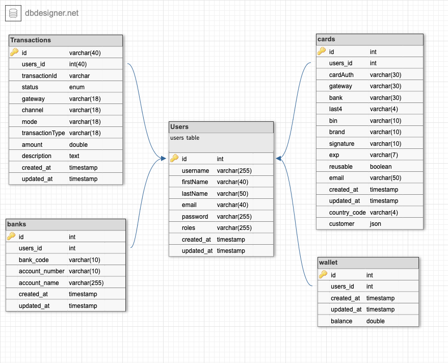

# Wallet Service
## Hosted on Heroku 
[ol4-Wallet](https://ol4-wallet.herokuapp.com/api/v1)

## Tools
- **Nodejs**
- **Nestjs**
- **Typescript**
- **Mysql** - Database
- **Jest** Test framework
- **Docker** Container
- **Knexjs** DB Orm
- **Paystack** Payment bed

## Endpoints
- Users [/users]
  1. Register new user [/register][POST]
  2. login [/login][POST]
  3. Get all users [/?queries][GET]
- Wallet [/wallet]
  1. get user wallet[/:id][GET]
  2. Get all users [/?queries][GET]

  

